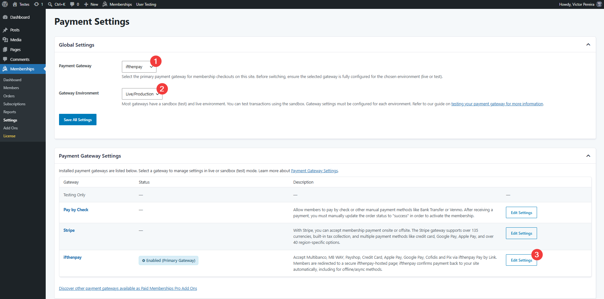
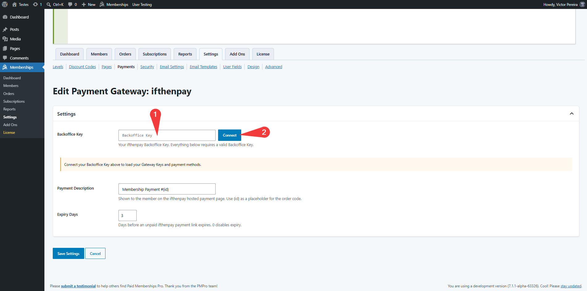
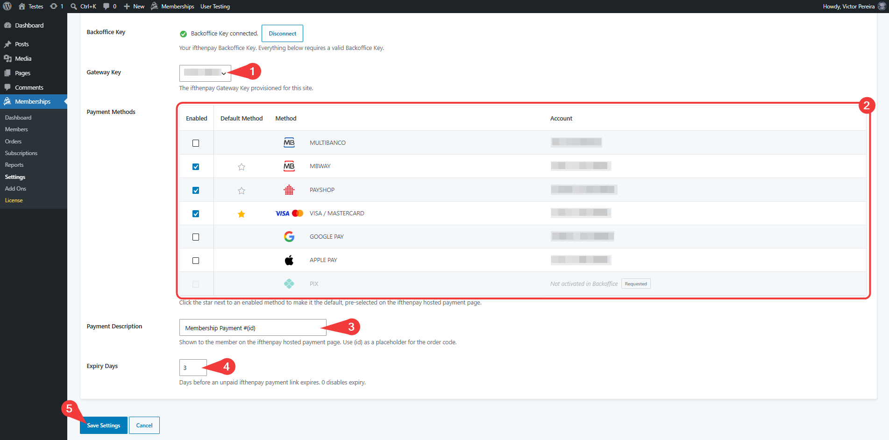
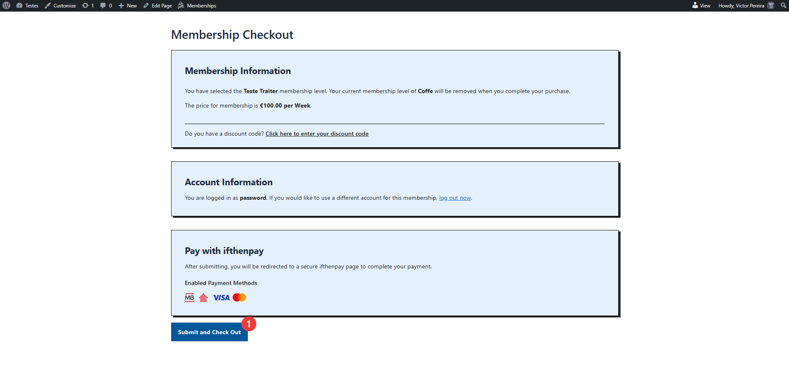
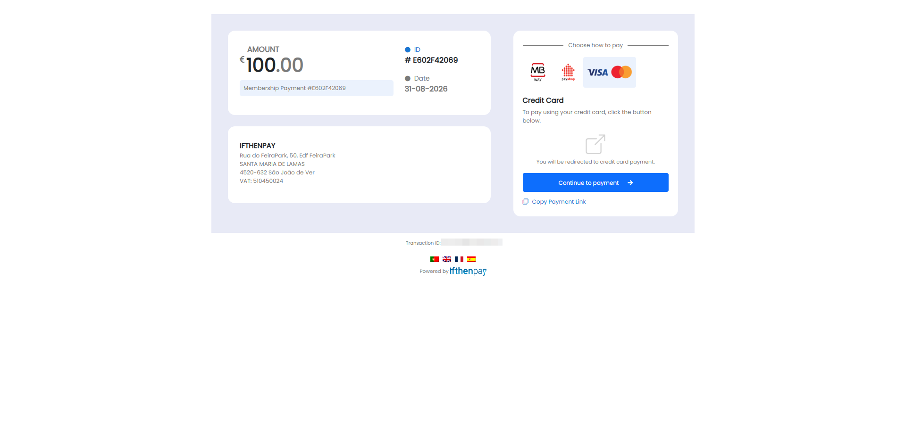
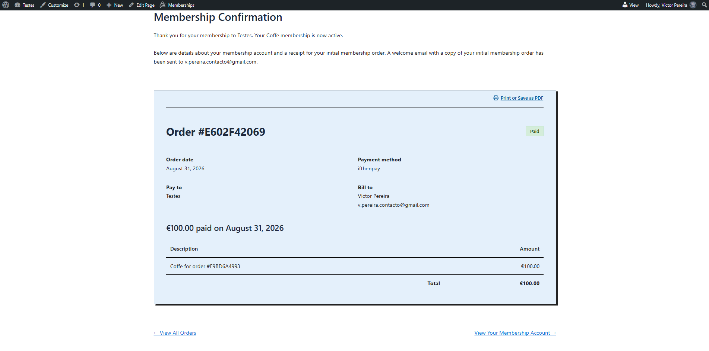
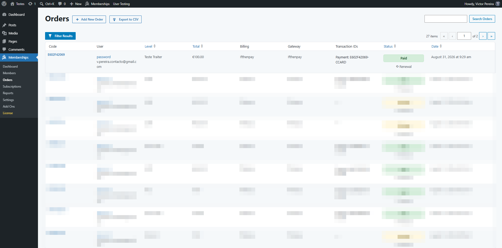
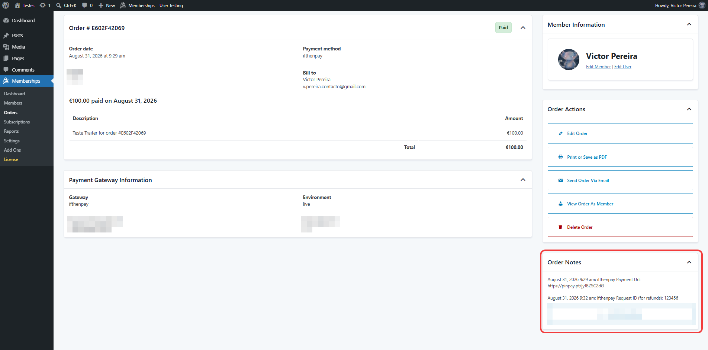

# ifthenpay | Payments for Paid Memberships Pro

Adds ifthenpay as a payment gateway for Paid Memberships Pro: Multibanco, MB WAY, Payshop, Credit Card, Apple Pay, Google Pay and more via Pay by Link.

---

## Table of Contents

- [Description](#description)
- [Key Features](#key-features)
- [Requirements](#requirements)
- [Installation](#installation)
- [Frequently Asked Questions](#frequently-asked-questions)
- [External Services](#external-services)
- [Screenshots](#screenshots)
- [Support](#support)

## Description

This plugin integrates the ifthenpay payment gateway with Paid Memberships Pro so members can pay for their membership using Portugal's most popular local payment methods, directly from your membership checkout. Membership payments are processed through ifthenpay's secure Pay-By-Link system — no card or banking data is ever stored on your website. After starting checkout, the member is redirected to a secure ifthenpay-hosted payment page to complete the transaction; ifthenpay then notifies your site via a server-to-server callback so the order status updates and membership is granted automatically, including for offline/async methods like Multibanco and Payshop.

### In plain terms you get:

- Membership checkout through Paid Memberships Pro's own checkout flow
- A single settings screen to connect your ifthenpay Backoffice Key
- Automatic Gateway Key and payment-method sync from your ifthenpay Backoffice
- Secure, automatic payment confirmation via server-to-server callback
- No card numbers stored on your website

All settings are managed within Paid Memberships Pro's own Payment Settings screen and your ifthenpay Backoffice. The plugin is built so site owners can manage payments without needing deep technical knowledge.

## Key Features

1. Full integration with Paid Memberships Pro's payment gateway framework
2. Secure transactions via ifthenpay Pay-By-Link (off-site redirect to a hosted checkout)
3. Automatic, server-to-server payment confirmation (works for asynchronous/offline methods like Multibanco and Payshop)
4. Support for multiple payment methods (Multibanco, MB WAY, Payshop, Credit Card, Apple Pay, Google Pay, Cofidis, Pix)
5. Backoffice Key connection with automatic Gateway Key and payment-method sync
6. Configurable default payment method, payment description and link expiry
7. Real-time payment status on the Paid Memberships Pro Orders screen
8. Multi-language support (EN, ES, FR, PT)
9. Security-first approach (no card data stored)

## Requirements

- An active ifthenpay merchant account — [subscribe here](https://ifthenpay.com) to obtain your credentials.
- A Paid Memberships Pro Gateway Key (request this from ifthenpay support/helpdesk).
- The payment methods you want enabled on that Gateway Key (our helpdesk team will guide you).
- WordPress 6.0+ and PHP 7.4+, and Paid Memberships Pro installed and activated.
- HTTPS (SSL) enabled on your site.

## Installation

1. **Install:** Upload the plugin zip via `Plugins → Add New → Upload`, or install from WordPress.org, then Activate. Paid Memberships Pro must already be installed and active.
2. **Credentials:** Ensure your ifthenpay account has an active Paid Memberships Pro Gateway Key with the desired payment methods enabled.
3. **Setup:** Go to `Memberships → Settings → Payments → ifthenpay` and connect your Backoffice Key.
4. **Configure:** Choose your Gateway Key, enable the payment methods you want to accept, set a default method (the star column), a payment description and the link expiry in days.
5. **Activate:** Set ifthenpay as your site's primary Payment Gateway under `Memberships → Settings → Payments → Global Settings`.

## Frequently Asked Questions

<strong>Does this plugin require Paid Memberships Pro?</strong>

Yes. Paid Memberships Pro must be installed and active to use this plugin.

<strong>Where do I get an ifthenpay Backoffice Key?</strong>

Sign up at ifthenpay.com to get your Backoffice Key and a Paid Memberships Pro Gateway Key.

<strong>Does it support recurring membership levels?</strong>

Recurring levels can still be selected at checkout, but ifthenpay Pay-By-Link only automates the initial payment — like the built-in "Pay by Check" gateway, renewals are not automatically re-billed and must be completed manually by the member or admin.

<strong>Are payment details stored?</strong>

No. The plugin does not store card numbers or full banking details. Only minimal references required for payment matching are stored on the order.

<strong>Which payment methods are supported?</strong>

Any method enabled on your ifthenpay Gateway Key (e.g. Multibanco, MB WAY, Payshop, Credit Card, Cofidis, Google Pay, Apple Pay, Pix).

<strong>How does the payment process work?</strong>

After starting checkout, the member is redirected off-site to a secure ifthenpay-hosted payment page. The member's browser return only shows a confirmation/error page — the actual order status is set by a server-to-server callback, so it also works for offline/async methods like Multibanco or Payshop.

<strong>What happens if a payment fails or is cancelled?</strong>

The order is marked Failed or Cancelled once ifthenpay's callback reports the outcome, and the member is shown a message inviting them to try again.

<strong>How secure is the integration?</strong>

Requests are encrypted over HTTPS; no sensitive payment data is stored on your site.

## External Services

This plugin integrates with the ifthenpay payment platform to process payments for Paid Memberships Pro checkouts. ifthenpay is a third-party service that provides secure payment processing for methods including Multibanco, MB WAY, Payshop, Credit Card, Apple Pay, Google Pay, Cofidis and Pix.

- **Paid Memberships Pro**
  - **What it is and what it is used for**: The membership plugin this integration extends — this plugin registers `ifthenpay` as one of its payment gateways and hooks into its checkout, order and settings screens.

- **ifthenpay Backoffice & API**
  - **What it is and what it is used for**: The ifthenpay Backoffice is the merchant dashboard used to manage integrations and payment configurations. The plugin uses the ifthenpay API to look up Gateway Keys and payment methods, generate Pay-By-Link payment links, register the payment webhook and validate transactions.
  - **What data is sent and when**:
    - When an admin connects/refreshes the settings screen: the Backoffice Key and Gateway Key, to list available Gateway Keys and payment methods.
    - When a member checks out: the order code (`id`), amount, description, language, link expiry date, the enabled payment `accounts`, the pre-selected method, and the success/error/cancel return URLs.
    - During the server-to-server callback: the order reference, amount, payment method, request ID and an anti-phishing key, sent by ifthenpay back to your site.
  - **End-User License Agreement (EULA)**: [EULA](https://ifthenpay.com/eula/)
  - **Privacy Policy**: [Privacy Policy](https://ifthenpay.com/politica-de-privacidade/)

All network requests are performed server-side over HTTPS. Sensitive credentials are stored securely and are not publicly exposed. No raw card or bank details are stored.

## Screenshots

Below are screenshots demonstrating key features and interfaces of the plugin:

1. **(Admin Only) Payment Settings — ifthenpay listed as an available gateway**
   
2. **(Admin Only) Edit Payment Gateway: ifthenpay — connecting a Backoffice Key**
   
3. **(Admin Only) Edit Payment Gateway: ifthenpay — Gateway Key & payment methods configuration**
   
4. **(Member Experience) Membership Checkout — "Pay with ifthenpay" section**
   
5. **(Member Experience) ifthenpay hosted payment page**
   
6. **(Member Experience) Membership Confirmation — paid order receipt**
   
7. **(Admin Only) Orders list — membership order paid via ifthenpay**
   
8. **(Admin Only) Order detail — Payment Gateway Information & order notes**
   

## Support

For assistance use the [WordPress.org support forum](https://wordpress.org/support/plugin/ifthenpay-payments-for-paid-memberships-pro):

Pre-checks:
- Payment method enabled on Gateway Key AND mapped to your Paid Memberships Pro Gateway Key
- Running current recommended versions of WordPress, PHP, & Paid Memberships Pro

Commercial helpdesk available (no direct email required): [helpdesk.ifthenpay.com](https://helpdesk.ifthenpay.com/)

- **ifthenpay support**: [suporte@ifthenpay.com](mailto:suporte@ifthenpay.com)
- **Paid Memberships Pro docs**: [PMPro docs](https://www.paidmembershipspro.com/documentation/)
